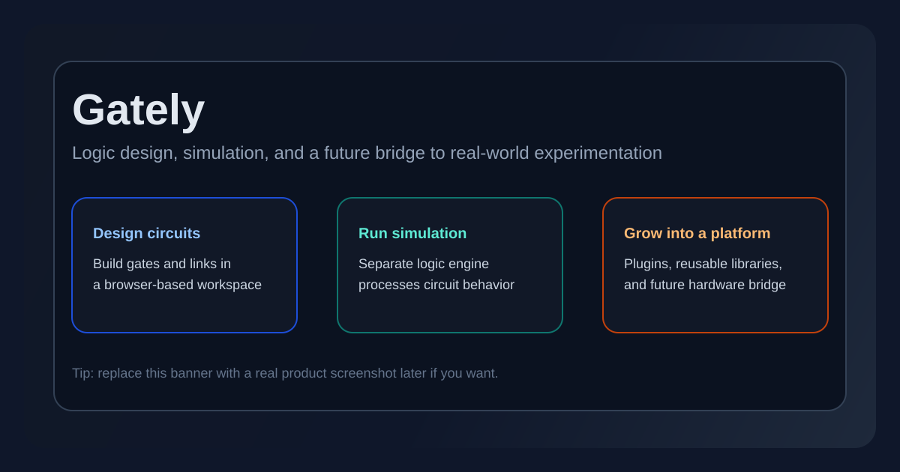
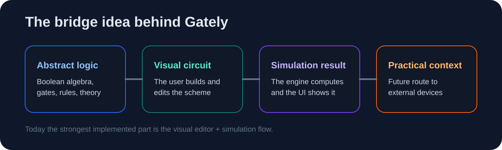
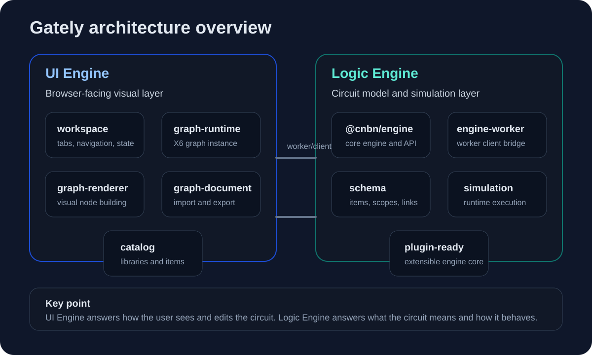

# Gately

<p align="center">
  
</p>

<p align="center">
  Gately — это веб-приложение для проектирования и симуляции логических схем.
  Ключевая идея проекта — стать мостом между абстрактной цифровой логикой,
  визуальным экспериментом и будущим переходом к реальному аппаратному взаимодействию.
</p>

<p align="center">
  Внутри репозитория часть пакетов пока использует историческое имя <code>cinabono</code> / <code>@cnbn/*</code>.
  По сути это выделенное ядро логического движка, на котором строится Gately.
</p>

> Статус: активная разработка / архитектурная переработка.  
> Репозиторий уже показывает основную идею продукта, разделение на движки, компонентную архитектуру и задел под плагины.  
> При этом часть публичных API еще выравнивается, поэтому текущую версию правильнее воспринимать как развивающийся MVP, а не как завершенную платформу.

## Содержание

- [Что Такое Gately](#что-такое-gately)
- [Зачем Нужен Проект](#зачем-нужен-проект)
- [Что Уже Можно Использовать Сейчас](#что-уже-можно-использовать-сейчас)
- [Скриншоты И Демо](#скриншоты-и-демо)
- [Для Кого Это](#для-кого-это)
- [Gately Как Мост](#gately-как-мост)
- [Архитектура](#архитектура)
- [Расширяемость Через Плагины](#расширяемость-через-плагины)
- [Структура Репозитория](#структура-репозитория)
- [Быстрый Старт](#быстрый-старт)
- [Цели Проекта](#цели-проекта)
- [Roadmap](#roadmap)

## Что Такое Gately

Gately — это браузерная среда, в которой можно собирать и симулировать логические схемы.

Если объяснять совсем просто, пользователь получает визуальное рабочее пространство, где можно:

- собрать схему из базовых логических элементов,
- соединить входы и выходы,
- запустить симуляцию,
- увидеть, как схема ведет себя в работе,
- понять цифровую логику через действие, а не только через теорию.

То есть Gately — это не просто "редактор логических вентилей на канвасе", а попытка сделать цифровую логику понятнее, нагляднее и ближе к практике.

## Зачем Нужен Проект

Идея Gately выросла из простой проблемы: при изучении цифровой логики между теорией и практикой часто остается заметный разрыв.

- Студенты изучают булеву алгебру, таблицы истинности и логические элементы.
- Симуляторы позволяют проверить схему виртуально.
- Но прикладной смысл этих абстракций все равно часто остается неочевидным.

Gately задуман как мост между несколькими уровнями:

- абстрактная логика,
- визуальное моделирование схем,
- наблюдаемый результат,
- и в перспективе — работа с внешними устройствами.

Именно поэтому для меня это не просто симулятор, а основа для более широкой образовательной и инженерной платформы.

## Что Уже Можно Использовать Сейчас

На текущем этапе в репозитории уже есть основа браузерного симулятора логических схем.

- Рабочее пространство с вкладками для отдельных схем и сессий.
- Визуальный графовый редактор для размещения и соединения узлов.
- Базовая стандартная библиотека логических элементов.
- Встроенные элементы: `TOGGLE`, `TRUE/FALSE CONSTANT`, `LAMP`, `7-SEG DISPLAY`, `BUFFER`, `AND`, `OR`, `NOT`, `NAND`, `NOR`, `XOR`, `XNOR`.
- Цикл симуляции через отдельный логический движок.
- Несколько режимов выполнения симуляции, включая быстрый и пошаговый.
- Разделение между визуальным UI-движком и логическим движком, работающим через worker-клиент.

Иными словами, Gately уже можно показывать как:

- понятный концептуальный браузерный симулятор,
- инженерный эксперимент с модульной архитектурой,
- и основу для дальнейшего роста в полноценную платформу.

## Скриншоты И Демо

Для README и собеседований лучше не перегружать страницу десятком однотипных картинок.
Достаточно 3 сильных кадров и 1 короткого демо-видео.

Что лучше всего показать:

- Обложка проекта.
  Готовая схема в workspace, чтобы с первого экрана было видно: это именно редактор и симулятор логических схем.
- Полусумматор или сумматор.
  Два входа, выход `SUM`, выход `CARRY`, несколько ламп или других индикаторов состояния.
- `7-seg` дисплей.
  Хороший кадр, где несколько переключателей меняют вход, а дисплей визуально реагирует.
- Короткое демо сборки.
  Небольшое видео или GIF, где вы за 20-40 секунд собираете простую схему и запускаете симуляцию.

Рекомендованный сценарий для демо:

1. Добавить `TOGGLE`-входы.
2. Собрать полусумматор на `XOR` и `AND`.
3. Подключить `LAMP` для `SUM` и `CARRY`.
4. Показать, как изменение входов сразу меняет результат.

Второй хороший сценарий:

1. Подать несколько входов на `7-SEG DISPLAY`.
2. Переключать значения через `TOGGLE`.
3. Показать, что схема не просто считается внутри, а дает наглядный визуальный результат.

По формату медиа для GitHub:

- Для README лучше всего работают PNG-скриншоты и один GIF.
- Полноценное видео лучше хранить отдельно и давать на него ссылку из раздела README.
- Если хотите показать триггеры или более сложные схемы, лучше делать это как дополнительное демо, а не как первый экран проекта.

Готовый шаблон, который можно будет вставить позже, когда снимете реальные материалы:

```md
## Демонстрация

### Интерфейс редактора


### Полусумматор


### 7-seg дисплей


### Видео

- [Сборка полусумматора в Gately](https://your-video-link)
- [Демонстрация 7-seg дисплея](https://your-video-link)
- [Дополнительное демо триггера](https://your-video-link)
```

## Для Кого Это

| Аудитория | Чем полезен Gately |
| --- | --- |
| Студенты | Помогает понять логику визуально, быстро проверять гипотезы и сократить разрыв между теорией и практикой. |
| Преподаватели | Дает наглядный инструмент для демонстрации схем, примеров и практических заданий. |
| Самообучающиеся | Позволяет использовать виртуальную лабораторию без необходимости сразу переходить к физической сборке. |

## Gately Как Мост

<p align="center">
  
</p>

Главная идея Gately — не в том, чтобы сделать "еще один редактор логических элементов".

Сильнее здесь другое:

1. Пользователь собирает схему визуально.
2. Логический движок вычисляет состояние схемы.
3. UI-движок показывает результат в наглядной форме.
4. В будущем этот же поток можно продолжить до внешних устройств и аппаратных экспериментов.

Сейчас самая сильная реализованная часть проекта — это первые три шага.
Четвертый шаг — это продуктовый вектор и архитектурная цель.

## Архитектура

<p align="center">
  
</p>

Сейчас архитектуру лучше объяснять просто и без перегруза внутренними деталями.

У Gately есть два ядра:

- `UI Engine` — визуальный движок поверх `SolidJS signals` и `AntV X6`, который отвечает за SVG-редактор, отображение схемы, документы, каталог и визуальную сторону симуляции.
- `Logic Engine` — логический движок `Cinabono`, написанный с нуля и отвечающий за модель схемы, вычисление состояний и саму симуляцию.

Между собой они общаются через `Web Worker`.

Именно это разделение сейчас и важно показывать:

- UI-ядро отвечает за то, как схема выглядит и как с ней взаимодействует пользователь,
- logic-ядро отвечает за то, что схема означает и как она работает.

Внутренняя композиция UI-движка еще меняется, поэтому в README лучше делать акцент не на полном списке внутренних компонентов, а на самой идее разделения визуального и вычислительного слоев.

## Расширяемость Через Плагины

Оба движка изначально проектируются с учетом расширяемости.

### Плагины Логического Движка

Логический движок уже поддерживает плагины, которые могут:

- расширять дерево зависимостей,
- расширять публичное API,
- регистрировать wrappers,
- выполнять setup-логику при инициализации движка.

Это одна из причин, почему ядро проекта ценно не только внутри одного UI.

### Плагины UI-Движка

У UI-движка тоже есть свой плагинный слой.
В текущем коде он уже используется для таких вещей, как:

- инструменты выделения,
- инструменты редактирования ребер,
- поведение взаимодействия с узлами,
- lifecycle-обновления визуального слоя,
- кеширующие graph lifecycle hooks.

Эта часть пока сырая, но архитектурное направление уже заложено:
Gately строится как система, в которую новые визуальные поведения и интеграции можно подключать, а не вшивать везде вручную.

## Структура Репозитория

Этот репозиторий — монорепа.

```text
apps/
  web/                  Браузерный клиент Gately

packages/
  engine/               Ядро логического движка
  engine-worker/        Worker-мост для движка
  schema/               Примитивы схемы и структуры данных
  simulation/           Runtime-часть симуляции
  entities-runtime/     Поддержка runtime-сущностей
  modules-runtime/      Поддержка runtime-модулей
  di/                   Инструменты dependency injection
  helpers/              Общий слой helper-функций
  utils/                Универсальные утилиты
  config/               Общие конфиги
  error/                Ошибки и вспомогательные конструкции
```

Если смотреть код в первый раз, то самый быстрый путь понять проект такой:

1. начать с `apps/web`,
2. потом посмотреть `apps/web/src/shared/infrastructure/LogicEngine`,
3. затем `apps/web/src/shared/infrastructure/ui-engine`,
4. и только после этого углубляться в переиспользуемые пакеты из `packages/*`.

## Быстрый Старт

Если вы хотите посмотреть проект локально:

```bash
pnpm install
pnpm --filter web dev
```

Полезные команды рабочего пространства:

```bash
pnpm --filter web test
pnpm build
```

Важно: репозиторий сейчас находится в активной архитектурной переработке.
Это значит, что на отдельных ветках или коммитах может требоваться дополнительное выравнивание публичных экспортов, типов и интеграции между UI- и logic-слоями.

## Цели Проекта

Текущая цель Gately — не просто симулировать логические схемы, а сделать их понятными и полезными в прикладном контексте.

Если коротко, цели проекта такие:

- сделать цифровую логику более наглядной и понятной,
- помочь пользователю быстрее проверять идеи,
- сократить дистанцию между теорией и наблюдаемым результатом,
- создать техническую основу, которая может вырасти из симулятора в платформу.

## Roadmap

### Ближайшие Шаги

- Стабилизировать публичный API между UI-слоем и логическим движком.
- Расширить стандартную библиотеку компонентов.
- Улучшить инструменты отладки и визуального анализа состояния схемы.
- Довести текущие редакторские сценарии до согласованного состояния в новой архитектуре.

### Продуктовое Направление

- Поддержать более богатые библиотеки и переиспользуемые модули схем.
- Добавить обмен и распространение пользовательских схем.
- Ввести учебные сценарии, задания или guided-flow режимы.
- Усилить мост к внешним аппаратным сценариям.
- Превратить Gately из симулятора в платформу.

### Долгосрочное Видение Платформы

В долгосрочной перспективе Gately должен стать средой, где:

- пользователи проектируют схемы,
- преподаватели собирают учебные сценарии,
- библиотеки компонентов расширяются,
- плагины добавляют поведение и интеграции,
- а одна и та же экосистема связывает симуляцию с практическим экспериментом.

Для меня в этом и состоит настоящая амбиция Gately:
не просто инструмент для отрисовки вентилей, а расширяемая среда, которая делает цифровую логику осязаемой.
