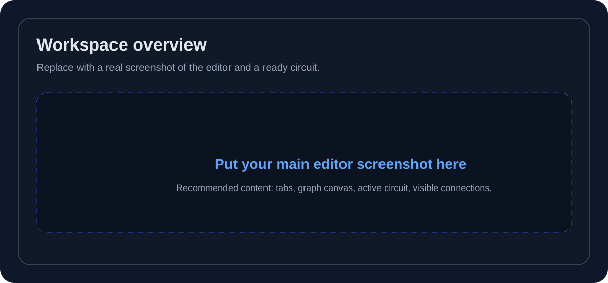
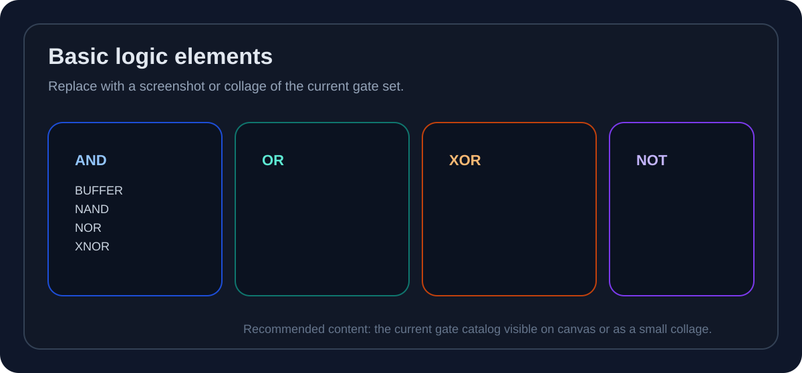
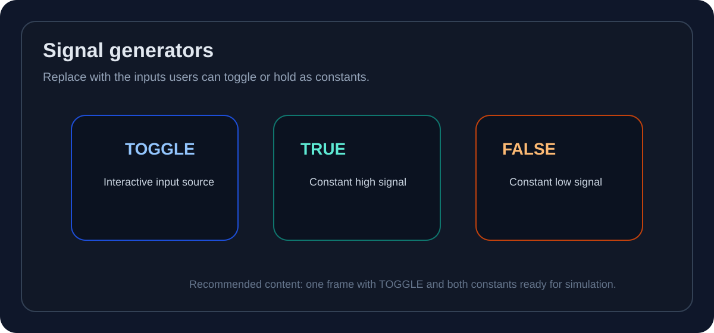
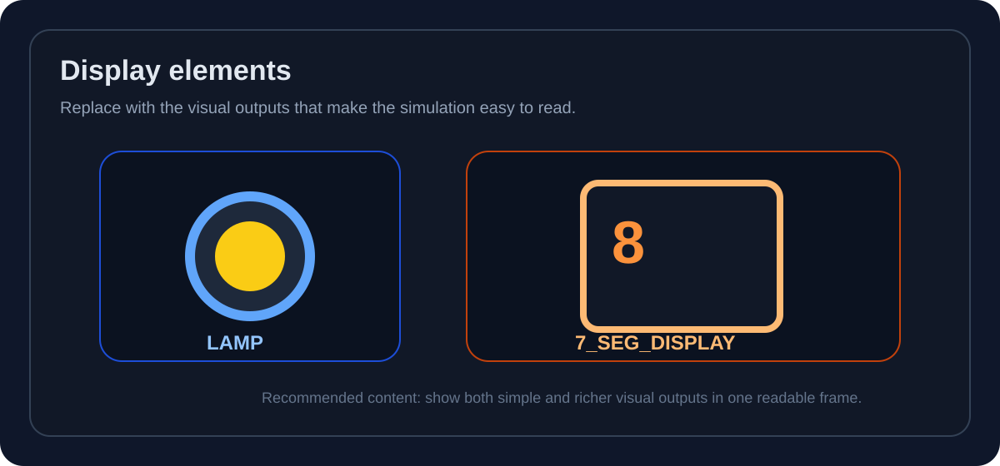
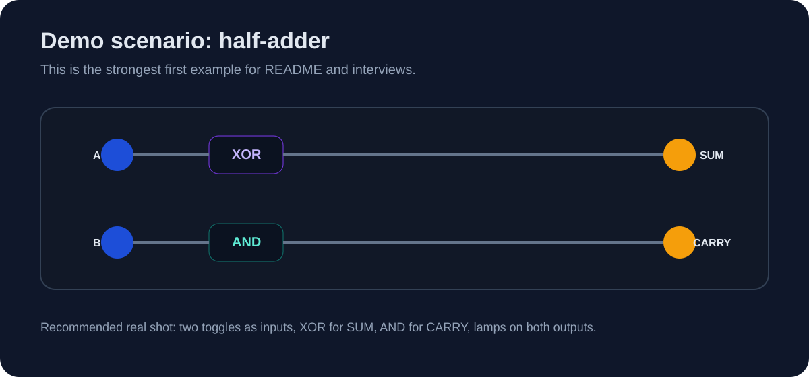
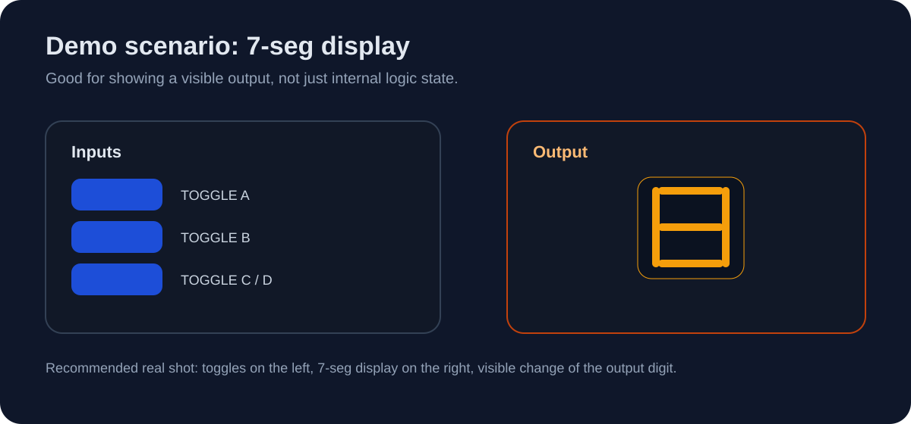
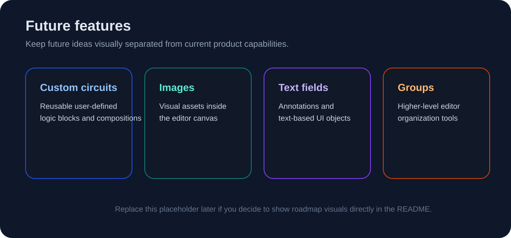

# Gately

<p align="center">
  
</p>

<p align="center">
  Gately - веб-приложение для проектирования и симуляции логических схем.
  Идея проекта - сделать цифровую логику более наглядной: от сборки схемы до наблюдаемого результата.
</p>

<p align="center">
  <strong>EN:</strong> Gately is a browser-based logic circuit editor and simulator built around a visual UI engine, a custom logic core, and worker-based communication.
</p>

<p align="center">
  <a href="#demo">Демонстрация</a> ·
  <a href="#architecture">Архитектура</a> ·
  <a href="#quick-start">Запуск</a> ·
  <a href="#roadmap">Roadmap</a>
</p>

## Что Такое Gately

Gately - это браузерная среда, в которой можно собирать логические схемы из готовых элементов, соединять их визуально, запускать симуляцию и сразу видеть результат.

Сейчас проект лучше всего воспринимать как развивающийся MVP редактора и симулятора, который уже полезен для учебных, демонстрационных и инженерных сценариев, но при этом еще продолжает активно формироваться.

## Как Его Можно Использовать Уже Сейчас

Сейчас Gately уже можно использовать как:

- визуальный редактор простых логических схем;
- среду для изучения базовых логических элементов и поведения сигналов;
- наглядный стенд для демонстрации полусумматора, сумматора и других небольших схем;
- основу для дальнейшего роста в более полноценную платформу.

Что уже есть в проекте:

- визуальный редактор схем в браузере;
- базовые логические элементы: `BUFFER`, `AND`, `OR`, `NOT`, `NAND`, `NOR`, `XOR`, `XNOR`;
- генераторы сигнала: `TOGGLE`, `TRUE_CONSTANT`, `FALSE_CONSTANT`;
- отображатели: `LAMP`, `7_SEG_DISPLAY`;
- логический движок, работающий отдельно от UI;
- связь между UI и логическим ядром через `Web Worker`;
- модульная основа для дальнейшего расширения и плагинной интеграции в обоих ядрах.

Самые понятные сценарии для текущей версии - это базовые логические элементы, генераторы сигнала, отображатели, полусумматор и `7-seg` дисплей.

<a id="demo"></a>
## Демонстрация

Ниже оставлены плейсхолдеры под реальные скриншоты и GIF. Их можно постепенно заменить без переписывания README.

### 1. Общий Вид Редактора

<p align="center">
  
</p>

Сюда лучше поставить основной экран приложения: workspace, канвас, готовую схему и видимые соединения.

### 2. Базовые Логические Элементы

<p align="center">
  
</p>

Хороший кадр для обзора текущей библиотеки базовых вентилей: `AND`, `OR`, `NOT`, `NAND`, `NOR`, `XOR`, `XNOR`, `BUFFER`.

### 3. Генераторы Сигнала

<p align="center">
  
</p>

Здесь стоит показать элементы, которые создают входные состояния схемы: `TOGGLE`, `TRUE_CONSTANT`, `FALSE_CONSTANT`.

### 4. Отображатели

<p align="center">
  
</p>

Этот кадр полезен для быстрой демонстрации того, что симуляция дает не только вычисление, но и видимый результат через `LAMP` и `7_SEG_DISPLAY`.

### 5. Сценарий: Полусумматор

<p align="center">
  
</p>

Это один из лучших demo-кейсов для проекта: он простой, наглядный и хорошо показывает связь между входами и выходами `SUM` / `CARRY`.

### 6. Сценарий: 7-Seg Дисплей

<p align="center">
  
</p>

Здесь удобно показать, как изменение входов через `TOGGLE` сразу отражается в визуальном состоянии дисплея.

### 7. GIF Или Короткое Видео

Для README лучше всего подойдет один короткий GIF на 20-40 секунд.
Если хочется показать больше, лучше добавить отдельную ссылку на видео с полным сценарием.

Рекомендуемые demo-сценарии:

- сборка полусумматора на `XOR` и `AND`;
- переключение входов и наблюдение за `SUM` / `CARRY` через лампы;
- демонстрация `7-seg` дисплея через `TOGGLE`;
- короткий обзор редактора с несколькими уже готовыми элементами на сцене.
- опционально - отдельное advanced-demo с триггером, если этот сценарий уже стабильно выглядит в UI.

Удобные имена файлов для будущих медиа:

- `docs/images/demo/workspace-overview.png`
- `docs/images/demo/basic-logic-elements.png`
- `docs/images/demo/signal-generators.png`
- `docs/images/demo/display-elements.png`
- `docs/images/demo/half-adder.png`
- `docs/images/demo/seven-seg-display.png`
- `docs/images/demo/build-and-simulate.gif`

### В Планах

<p align="center">
  
</p>

Будущие возможности лучше показывать отдельно от текущего состояния, чтобы не смешивать готовый MVP с roadmap.

Сюда логично отнести:

- кастомные схемы;
- картинки;
- текстовые поля;
- группы;
- более богатые редакторские объекты и пользовательские сценарии.

## Зачем Нужен Проект

При изучении цифровой логики почти всегда есть один и тот же разрыв: между абстрактной теорией, схемой на экране и тем, как эта схема ощущается в реальной работе.

Gately задуман как мост между:

- логическими правилами и визуальной практикой;
- схемой как структурой и схемой как поведением;
- экспериментом в редакторе и наблюдаемым результатом;
- учебным сценарием сегодня и более прикладной платформой в будущем.

Проект интересен не только как симулятор, но и как попытка собрать понятный пользовательский слой поверх собственного логического ядра.

<a id="architecture"></a>
## Архитектура

<p align="center">
  
</p>

Сейчас архитектуру проекта лучше объяснять максимально просто.

У Gately есть два ядра:

- `UI Engine` - визуальный движок поверх `SolidJS signals` и `AntV X6`, отвечающий за SVG-редактор, отображение схемы и взаимодействие пользователя;
- `Logic Engine` - логический движок `Cinabono`, написанный с нуля и отвечающий за модель схемы, вычисление состояний и симуляцию.

Связь между ними происходит через `Web Worker`.

Оба ядра строятся на компонентной архитектуре и проектируются так, чтобы в будущем допускать расширение через плагины. При этом README намеренно не уходит глубоко во внутреннюю карту модулей, потому что этот слой еще меняется.

## Текущий Статус

Проект находится в активной разработке. Честнее всего воспринимать его как сильный MVP с уже понятной идеей, рабочим браузерным сценарием и архитектурным заделом под дальнейший рост.

Что уже выглядит уверенно:

- сама идея проекта как визуального моста для цифровой логики;
- разделение на UI-ядро и логическое ядро;
- браузерный редактор и симуляция базовых схем;
- направление в сторону расширяемой платформы.

Что пока не стоит перегружать в README:

- нестабильные внутренние детали реализации;
- слишком подробную карту UI-модулей;
- будущее расширение так, будто оно уже готово.

<a id="quick-start"></a>
## Быстрый Старт

Для локального запуска веб-клиента:

```bash
pnpm install
pnpm --filter web dev
```

Полезные дополнительные команды:

```bash
pnpm --filter web test
pnpm --filter web build
```

<a id="roadmap"></a>
## Что Дальше

Ближайшие направления развития проекта:

- расширение библиотеки элементов;
- улучшение инструментов симуляции и визуального анализа;
- добавление кастомных схем и более богатых редакторских объектов;
- обмен пользовательскими схемами;
- развитие проекта в сторону полноценной платформы;
- дальнейшее развитие плагинной архитектуры.

<details>
<summary><strong>Технические заметки для разработчика</strong></summary>

Проект хранится как монорепозиторий.

```text
apps/web              браузерный клиент Gately
packages/engine       ядро логического движка
packages/engine-worker
packages/schema
packages/simulation
```

Внутри web-клиента UI-слой уже раскладывается на отдельные блоки вроде документа, каталога, рендера графа и симуляции. Эта карта еще будет меняться, поэтому в основном README она показана только на уровне двух ядер.

</details>
